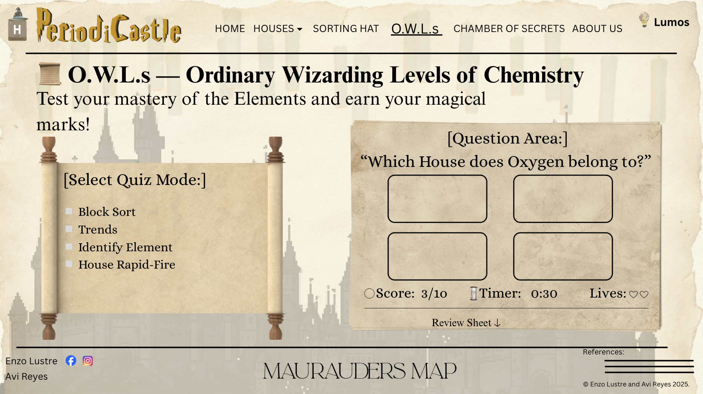
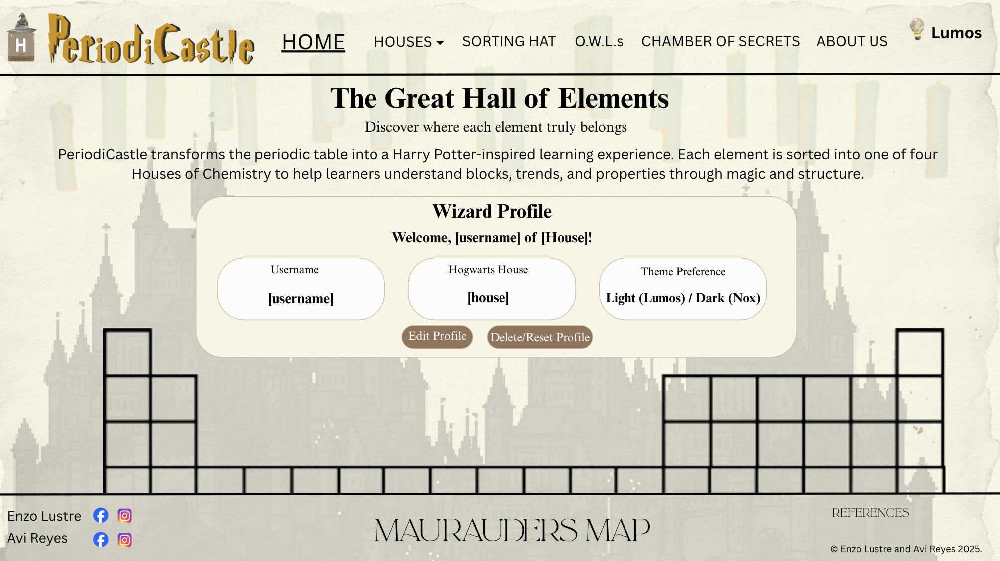
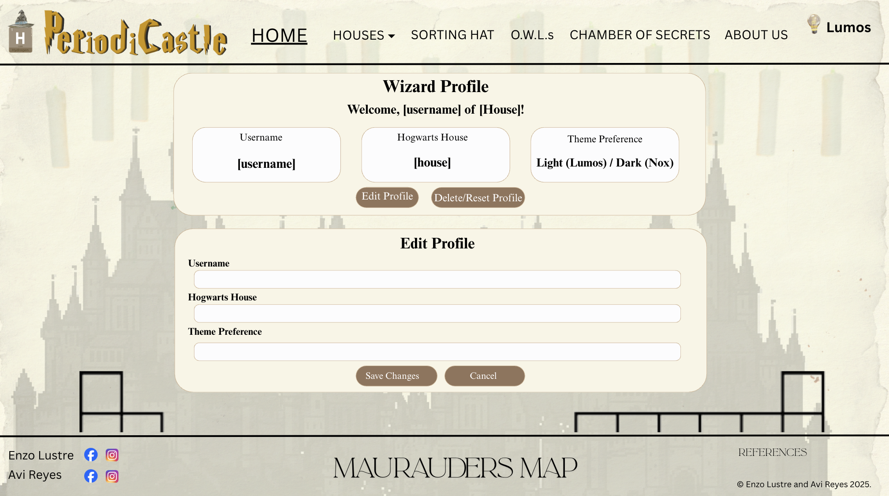

# PeriodiCastle

## Sorting Elements into The Four Houses of Chemistry

### Favicon: 

---

### Description:

PeriodiCastle is a whimsical and study-friendly website that transforms the periodic table into a Harry Potter-style design. Each 
element is “sorted” into one of the four Houses of Chemistry — Gryffindor (s-block), Slytherin (p-block), Hufflepuff (d-block), or 
Ravenclaw (f-block), in order to aid students and learners alike in remembering the structure of the blocks, the trends, and their 
respective properties. Users can hover on an element to reveal information about it or even use a sorting hat feature to classify an 
element by name, symbol, or property. After learning, they may also challenge themselves in Quiz Mode.

Beyond the name, PeriodiCastle focuses on clear information propagation, accessible User Interface (UI), and modular JavaScript (JS) for search, sorting, and quizzes. Other unique features include audio toggles that let users play either the Harry Potter theme song or the Periodic Table song while studying, and a Lumos switch offering light/dark mode for comfort.

---

### Webpage Breakdown:
* **Home:** This will contain the periodic table itself which would be designed with a Harry Potter theme. Above it, there will be a short description of the website itself, while below, there will be paragraphs regarding the history of the periodic table, but presented in a “Harry Potter-like” way.
* **P1 (Gryffindor):** This part will contain all the elements that are part of the Gryffindor house (s-block). There will also be fun facts about the elements and the people known for discovering them. This would be the same for all houses.
* **P2 (Slytherin):** Similar to Gryffindor, but for Slytherin (p-block).
* **P3 (Hufflepuff):** Similar to Gryffindor, but for Hufflepuff (d-block).
* **P4 (Ravenclaw):** Similar to Gryffindor, but for Ravenclaw (f-block).
* **P5 (Sorting Hat):** This will be a search engine, wherein if you provide an element’s name, symbol, or other properties/information about the element, it will show you what house it belongs to. 
* **P6 (O.W.L.s):** O.W.L.s stands for the Ordinary Wizarding Levels which are a series of exams taken by Hogwarts students. This page can be used by students to study with various modes (Block Sort, Trends, Identify Element, and House Rapid-Fire). There’ll also be other features such as timers, scoring, streaks, and a review sheet with explanations.
* **P7 (Chamber of Secrets):** This is more of a creative page (wikipedia-like) with short articles about chemistry seen in the Harry Potter world. For instance, there could be one about acids or bases in potion analogies or one about the chemistry they used for props. 
* **P8 (About Us):** This will be a simple Harry Potter-themed about us page.
* **P9 (Maurauder's Map):** To visually represent the site’s structure, PeriodiCastle features an interactive navigation map inspired by the Marauder’s Map. Displayed as a standalone page, it connects all major sections using circles over a parchment background. The navigation for this would be found in the footer of all pages.
* **P10 (References):** All references used for the making of the website will be compiled here.

**Other Notes**
1. The header will contain the favicon, name of the website, navigation bar, as well as a button with a unique feature which would switch between light and dark mode. This button is labeled as "Lumos".
2. The footer will have social media links on the left, a hyperlink to the Maurauder's Map in the center, and sources and copyright notices on the right.

---

> Various webpages will make use of JS to make our website more interactive and creative. For one, we have the Sorting Hat, where certain inputs will cause different outputs through a decision statement. Another use for it would be for the O.W.L.s page, wherein JS script will be used for the quiz itself, as well as other unique features. JS will also be consistently used on all pages for the dropdown in the header of the houses, along with the switching from light to dark mode.

---

### Wireframe/Webpage Design:
**Home Page** (updated)

**House Pages (Gryffindor)**

**Sorting Hat**

**O.W.L.s**

**Chamber of Secrets** (updated)

**Maurauders Map**

**Q2 Live Preview:** 
[View the website here](https://avieszha.github.io/WDProjRubidiumLustreReyes/design.html)

---

# Q3 Project Proposal Update

## Final Title: PeriodiCastle

## Features
* Works on both phone and laptop
* Available in both light and dark mode, which could be altered in the website itslef
* Can play the Harry Potter theme song or Periodic Table song while browsing through the webpages

## Details
* We will use HTML forms for users to create personalized profiles on our website.
* This data will be saved on the user’s computer by localStorage.
* We will show the data we collect on the Home Page and Chamber of Secrets Page. See more info at the next part regarding the HTML form.

## Definition of Done
* Every page can successfully switch from dark to light mode, and vice versa.
* The Harry Potter theme song and Periodic Table song can play smoothly.
* The website features various cool attributes brought by HTML, CSS, and JS.
* The magic of Chemistry is brought to life by the websire.
* The website satisfies our inner potterheads!

___

## Design and Narrative of the HTML Form

The website will include a Sign-Up/Profile Setup HTML form that would enable users to create personalized profiles on the website. The form is meant to obtain basic information, which would be used to customize the contents and design of the website.

In the registration page, users will be required to enter details like their username, house in Hogwarts, and theme preference, whether light or dark. Submission of these details will help the website recognize those who are using the website again, and customize it based on their choices.

When submitted, the data will be stored on the user's computer, using localStorage, a function that the browser uses to store information that can still be accessible after the browser is closed. This eliminates the function of the database, while still allowing the storage and retrieval of user preferences.

Such data will then be accessed by other web-pages on the site to offer personal details like welcome messages, house details, recommended content, and preferred theme settings. In this way, the HTML form is the foundation for developing personalized features across multiple web pages. 

## Webpage 1: Registration / Profile Setup Page (New Page)

This newly created webpage will have the HTML sign-up form. The users can enter their information and submit the form. Once submitted, the details will be validated and stored in localStorage. The primary use of this page is to collect and store user data for later use throughout the website.

## Webpage 2: Profile Dashboard (Home Page)

The Great Hall of Elements, will be edited to retrieve user data that was saved in localStorage through the Sign-Up form. Once the page loads, the site will use the stored data to display a personalized welcome message, including the user’s saved username and Hogwarts house. The page will also display the selected theme (either light or dark).

## Webpage 3: Recommended Content Page (Chamber of Secrets)

The enchanted library will also be modified to use the saved user data.This webpage will show personalized content based on a user's house at Hogwarts. A message saying "Recommended for [username]" would be shown.

---
# FINAL MODIFICATION PROPOSAL

## Purpose of the Final Modification

For the final modification of PeriodiCastle, we will improve the profile system so that users can **update or remove the data that the website saves on their device**. Previously, users could create a profile and the website could read that data, but they could not easily change or delete it.

This update allows the website to support a full **CRUD process (Create, Read, Update, Delete)** using **localStorage**. In other words, users will be able to create their profile, view it on the website, edit their saved information, or remove it entirely if they want to reset their preferences.

---

## Design and Narrative: Updating and Removing Stored Data

When a user completes the registration form, information such as their **username, Hogwarts house, and theme preference** will be saved in the browser using **localStorage**. This allows the website to remember the user's preferences even if the page is refreshed or reopened later.

The saved data is then used across different pages of the website to personalize the experience, such as displaying a welcome message or showing recommended content.

### Updating Stored Data

Users will be able to change their saved information through an **Edit Profile feature on the Home Page**, which acts as the **Profile Dashboard**.

When the user clicks the **Edit Profile** button:

1. A form will appear containing the user’s currently saved information.
2. The user can edit fields such as:
   - Username
   - Hogwarts house
   - Theme preference
3. When the form is submitted, the new information will **replace the old data stored in localStorage**.
4. The updated information will immediately appear on the page.

This allows users to easily update their preferences without needing to create a new profile.

### Removing Stored Data

Users will also have the option to completely remove their saved profile information using a **Delete / Reset Profile** button.

When this button is pressed:

1. The website will **remove the saved profile data from localStorage**.
2. The personalized information will disappear from the interface.
3. The website will return to its **default state**, as if no profile had been created.

This gives users full control over the information that the website stores on their device.

---

## Updated Wireframes for CRUD Implementation

The following wireframes show how the **Update and Delete features** will be added to the website interface.

### Updated Home Page (Profile Dashboard)

The Home Page will now act as a **Profile Dashboard** where users can view and manage their stored information.

New elements on this page will include:

- A welcome message showing the saved username
- Display of the selected Hogwarts house
- Display of the chosen theme
- An **Edit Profile** button for updating information
- A **Delete / Reset Profile** button for removing saved data

---

### Edit Profile Form (Update Feature)

This interface will allow users to edit their existing profile information.

Users will be able to change:

- Username  
- Hogwarts house  
- Theme preference  

After submitting the form, the new information will **overwrite the previous data stored in localStorage**.

---

### Delete Profile Interface (Delete Feature)

This interface will include a button that allows users to clear their stored data.

When activated:

- All profile information saved in **localStorage** will be removed
- Personalized settings will be cleared
- The website will return to its default appearance

---

## Summary of CRUD Implementation

| Operation | Implementation |
|-----------|---------------|
| **Create** | Profile is created through the registration form |
| **Read** | Stored data is displayed on the Home Page and Chamber of Secrets |
| **Update** | Edit Profile feature allows users to modify saved data |
| **Delete** | Delete / Reset Profile removes stored data from localStorage |

With this final modification, PeriodiCastle demonstrates how **localStorage can be used to store, display, update, and remove user data**, allowing the website to offer a more personalized and interactive learning experience.